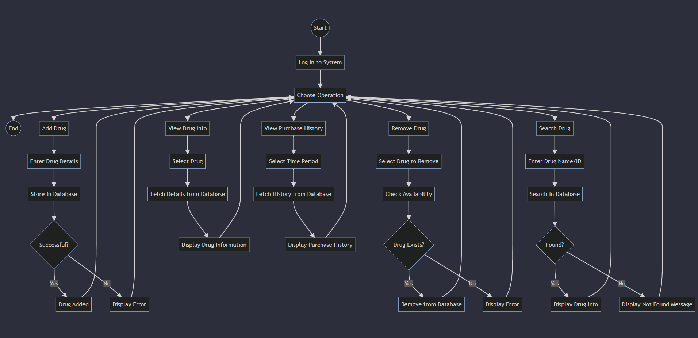

# Pharmacy Management System

## Overview
This project is a Drug Management System designed to help manage a database of drugs. It allows users to perform a variety of operations, including adding drugs, removing drugs, searching for drugs, viewing drug information, and viewing purchase history.

## Features
- Add Drug: Allows users to enter and store new drug details in the system.
- Remove Drug: Provides the functionality to remove an existing drug from the database.
- Search Drug: Enables users to search for a drug using its name or ID.
- View Drug Info: Displays detailed information about a selected drug from the database.
- View Purchase History: Shows the purchase history for drugs over a specified time period.

## How to Use

### Log In:
Log into the system using your credentials.

### Choose Operation:
Select from the following operations:
- Add Drug
- Remove Drug
- Search Drug
- View Drug Info
- View Purchase History

### Follow Prompts:
Depending on the operation chosen, follow the system prompts to enter or retrieve data.

#### Add Drug
- Enter drug details and store them in the database.
- If successful, the system will display a "Drug Added" message; otherwise, an error will be shown.

#### Remove Drug
- Select the drug to be removed.
- If the drug exists in the database, it will be removed; otherwise, an error will be shown.

#### Search Drug
- Enter the drug name or ID to search for it in the database.
- If found, drug information will be displayed; otherwise, a "Not Found" message will be shown.

#### View Drug Info
- Select a drug from the list, and its details will be fetched and displayed.

#### View Purchase History
- Select a time period, and the purchase history will be retrieved and displayed.

## Technologies Used

- **Backend**: Java for handling operations and database interactions.
- **Database**: MySQL for storing drug information.
- **Frontend**: JavaFx and FXML for the user interface.

## Installation
1. ```
    git clone https://github.com/KAsare1/Pharmacy-Management-System.git
    ```
   
2. Open your IDE and run the Main.java class found in
    ```
   src/main/java/com/example/pharmacy_management_system/Main.java
   ```
3. Login with credentials
   ```angular2html
   Username : admin
   Password : password123
   ```

## Application Flowchart
